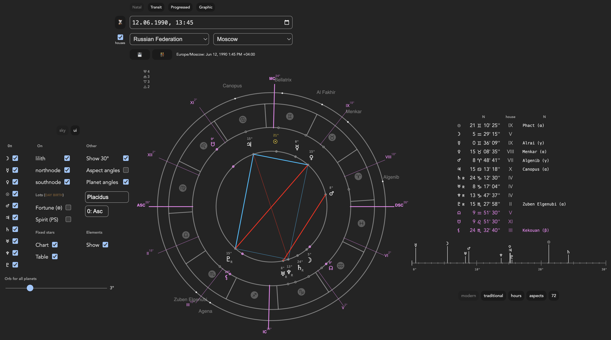

Check the live app at https://nufeen.github.io/ph/

Astro processor working as online website. Main goals: free processor for mac os and mobile phones.

Build electron package: `npm run build-electron`

## Features

Very basic set still complete enough for mobile usage

- Natal / Transit / Progressed charts
- Graphic Ephemeris (WIP)
- Basic planets and fictive points
- Traditional / Modern views
- 30 degrees panel
- Traditional day planetary hours table
- Save / load charts from IndexedDB (will get wiped with browser history)
- URL state sharing for bookmarks
- Orb correction slider

## Important Dependencies

- [astronomy-engine](https://www.npmjs.com/package/astronomy-engine) - planetary positions, coordinates
- [circular-natal-horoscope-js](https://www.npmjs.com/package/circular-natal-horoscope-js) - natal chart, houses, ascendant
- [sunrise-sunset-js](https://www.npmjs.com/package/sunrise-sunset-js) - sunrise/sunset times
- [city-timezones](https://www.npmjs.com/package/city-timezones) - city timezone lookup
- [country-city-location](https://www.npmjs.com/package/country-city-location) - country and city data
- [moment-timezone](https://www.npmjs.com/package/moment-timezone) - timezone conversions

## Flags

Hidden features enabled via browser console:

| Flag           | Default | Description                      |
| -------------- | ------- | -------------------------------- |
| `barbo`        | false   | Shows Barbo chart type           |
| `zodiacButton` | false   | Shows Tropical/Sidereal selector |
| `d72`          | false   | Shows 72 decans table            |

### Usage

```javascript
// Enable barbo chart type
window.localStorage.barbo = 'true'

// Enable zodiac type selector
// Logic based on western approach, experimental
window.localStorage.zodiacButton = 'true'

// Enable 72 decans / quinars table
window.localStorage.d72 = 'true'

// Disable a flag
window.localStorage.zodiacButton = 'false'
```

Refresh the page after changing flags.
